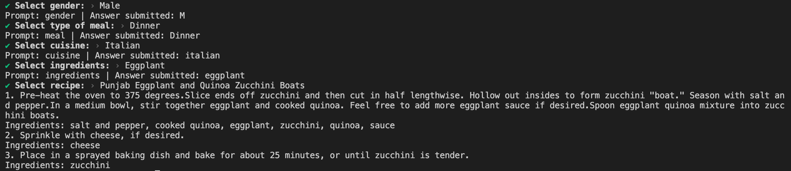

# Recipe Finder

A Node.js prompt to find the right cooking recipes based on user preferences.

## Install

```sh
nvm install # installs node version specified in .nvmrc
cp .env.example .env
npm install
```

## Start

Launch an interactive prompt:


```sh
npm start
```
